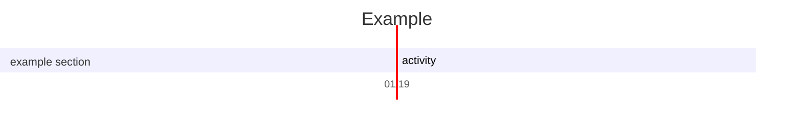
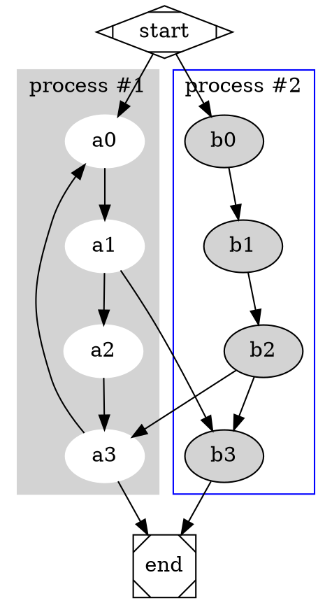

${toc}

# How to config vim 

## 方向键位映射

```bash
noremap j h
noremap k j
noremap i k
noremap z i
```

## 多文件

```
map sr :set splitright<CR>:vsplit<CR>
map sl :set nosplitright<CR>:vsplit<CR>
map su :set nosplitbelow<CR>:split<CR>
map sd :set splitbelow<CR>:split<CR>
map con: e ~/.vimrc.custom.config
map <LEADER>h <c-w>h
map <LEADER>l <c-w>l
```

## 一键编译
```bash
func! CompileRunGcc()
  exec "w"
  if &filetype == 'c'
    exec "!g++ % -o %<"
    exec "!time ./%<"
  elseif &filetype == 'cpp'
    exec "!g++ % -o %<"
    exec "!time ./%<"
  elseif &filetype == 'java'
    exec "!javac %"
    exec "!time java %<"
  elseif &filetype == 'sh'
    :!time bash %
  elseif &filetype == 'python'
    silent! exec "!clear"
    exec "!time python3 %"
  elseif &filetype == 'html'
    exec "!firefox % &"
  elseif &filetype == 'markdown'
    exec "MarkdownPreview"
  elseif &filetype == 'vimwiki'
    exec "MarkdownPreview"
  endif
endfunc

```
## 配置常用缩写
- `<C-d>` Ctrl + d
- `<S-d>` Shift + d
- `<nop>` no operation

## 配置键盘映射
- 配置插入模式键盘映射 inoremap 
- 配置普通模式键盘映射 noremap 

## Visual mode
- VISUAL LINE : shift v normal <command>
- VISUAL BLOCK : ctrl v shift i <some txt> ctrl c

## markdown plugins

markdown-preview
vim-table mode
- ,tm  opem table mode
- table `|| <space>` to auto complete
- ,tdd delete ro
- ,tdc delete cols
- ,tic insert cols


| Word  | expression |
|-------|------------|
| banaa | a fruit    |
| asas  | asasas     |
| asas  | asas       |


## snippets
一些配置
```code

autocmd Filetype markdown inoremap ,f <Esc>/<++><CR>:nohlsearch<CR>c4l
autocmd Filetype markdown inoremap ,n ---<Enter><Enter>
autocmd Filetype markdown inoremap ,b **** <++><Esc>F*hi
autocmd Filetype markdown inoremap ,s ~~~~ <++><Esc>F~hi
autocmd Filetype markdown inoremap ,i ** <++><Esc>F*i
autocmd Filetype markdown inoremap ,m $$ <++><Esc>F$i
autocmd Filetype markdown inoremap ,d `` <++><Esc>F`i
autocmd Filetype markdown inoremap ,c ```<Enter><++><Enter>```<Enter><Enter><++><Esc>4kA
autocmd Filetype markdown inoremap ,mb $$<Enter><++><Enter>$$<Enter><Enter><++><Esc>4kA
autocmd Filetype markdown inoremap ,h ====<Space><++><Esc>F=hi
autocmd Filetype markdown inoremap ,p  <++><Esc>F[a
autocmd Filetype markdown inoremap ,a [](<++>) <++><Esc>F[a
autocmd Filetype markdown inoremap ,1 #<Space><Enter><++><Esc>kA
autocmd Filetype markdown inoremap ,2 ##<Space><Enter><++><Esc>kA
autocmd Filetype markdown inoremap ,3 ###<Space><Enter><++><Esc>kA
autocmd Filetype markdown inoremap ,4 ####<Space><Enter><++><Esc>kA
autocmd Filetype markdown inoremap ,l --------<Enter>

```

- 网站 `,a`  [latex](https://www.latexlive.com) 非常好用的网站
- 图片 `,p`  

- inline code `,d` 
- code block `,c` 
```c++
#include "iostream"
int main() 
{
    return 0
}
```

- inline math $\int_{0}^{1}\ln x$ 
- math block  

$$
\sum_{1}^{n}\frac{1}{n} \to \infty 
$$


## 插件检测

: script
插件安装成功却无法正确使用，可能在配置插件时，设置了仅对某一类型的文件生效

## 配置 latex
```code
sudo apt-get install texlive-latex-base latex-cjk-all texlive-latex-extra
sudo apt-get install texlive-xetex texlive-publishers
sudo apt-get install latexmk
```
安装插件
```bash
filetype indent on

call plug#begin('~/.vim/plugged')
Plug 'lervag/vimtex'
call plug#end()

" vimtex配置
"
let g:tex_flavor='latex'
let g:vimtex_view_method='zathura'
let g:vimtex_quickfix_mode=0
set conceallevel=1
let g:tex_conceal='abdmg'
" 对中文的支持
let g:Tex_CompileRule_pdf = 'xelatex -synctex=1 --interaction=nonstopmode $*'
```

## 配置 snippets, markdown
[教程](https://www.jianshu.com/p/c0ba049878ca) 
```bash
Plug 'SirVer/ultisnips'
Plug 'honza/vim-snippets'
```


## TODO

- 写snippets
- 把snippets 的提示置顶
- 换个主题
    [sonokai](https://github.com/sainnhe/sonokai)
- 中文字体太丑
    换成 consolas + 微软雅黑混合字体

## flowchart



``` sequence-diagrams
Andrew->China: Says
Note right of China: China thinks\nabout it
China-->Andrew: How are you?
Andrew->>China: I am good thanks!
```


@startuml
Bob -> Alice : hello
@enduml


``` plantuml
Bob -> Alice : hello
```

$\sqrt{3x-1}+(1+x)^2$

$$\begin{array}{c}

\nabla \times \vec{\mathbf{B}} -\, \frac1c\, \frac{\partial\vec{\mathbf{E}}}{\partial t} &
= \frac{4\pi}{c}\vec{\mathbf{j}}    \nabla \cdot \vec{\mathbf{E}} & = 4 \pi \rho \\

\nabla \times \vec{\mathbf{E}}\, +\, \frac1c\, \frac{\partial\vec{\mathbf{B}}}{\partial t} & = \vec{\mathbf{0}} \\

\nabla \cdot \vec{\mathbf{B}} & = 0

\end{array}$$


``` flowchart
st=>start: Start|past:>http://www.google.com[blank]
e=>end: End|future:>http://www.google.com
op1=>operation: My Operation|past
op2=>operation: Stuff|current
sub1=>subroutine: My Subroutine|invalid
cond=>condition: Yes
or No?|approved:>http://www.google.com
c2=>condition: Good idea|rejected
io=>inputoutput: catch something...|future

st->op1(right)->cond
cond(yes, right)->c2
cond(no)->sub1(left)->op1
c2(yes)->io->e
c2(no)->op2->e
```




